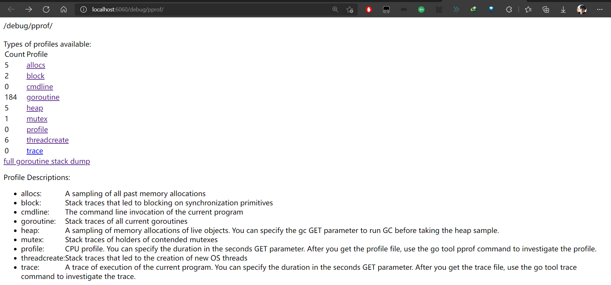
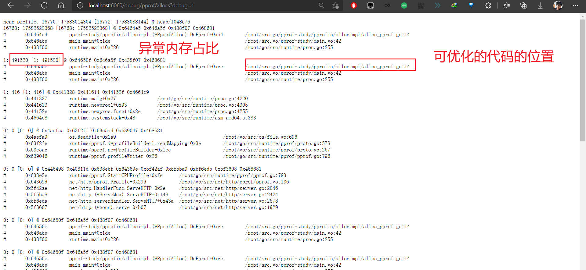
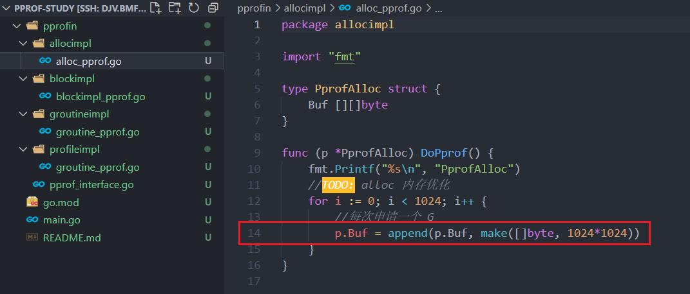
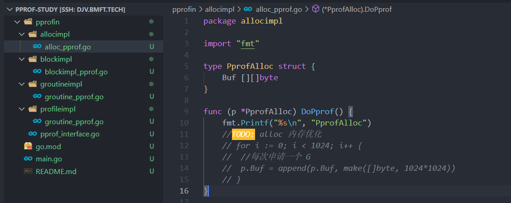
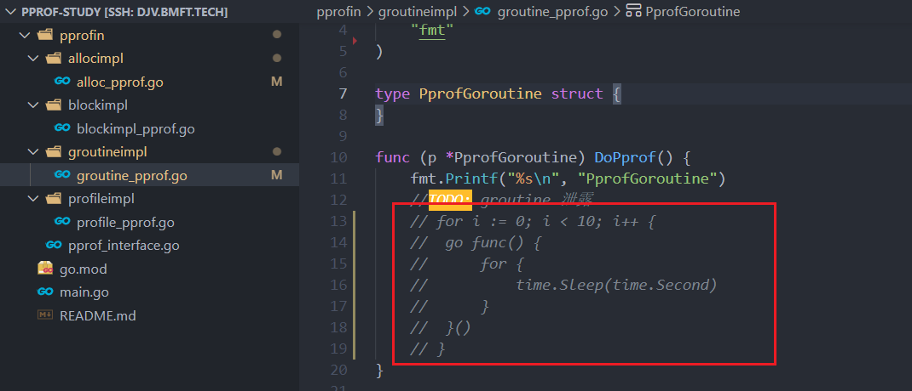
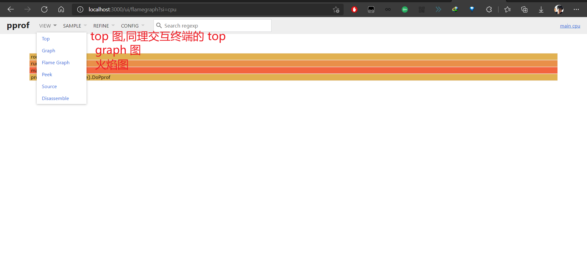
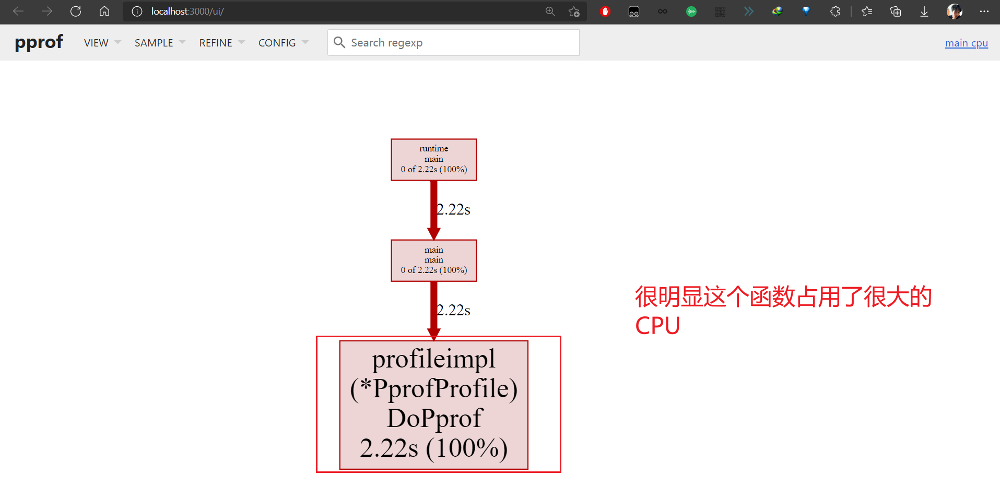
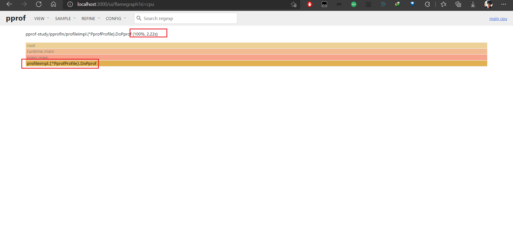
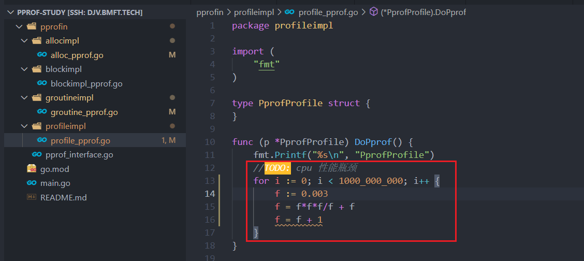

# pprof-study 

网上的大多数文章都介绍了pprof 性能分析优化的使用方式, 但是实战项目少之又少

> 本项目是一个 go pprof 实战项目, 下面将手把手带你通过 web, 交互界面, graph图/火焰图 找到性能优化位置并优化代码


## 启动示例代码

```bash
git clone git@github.com:dengjiawen8955/pprof-study.git

cd pprof-study

go mod tidy

go run mian.go
```

## 方式1: web 

浏览器下面的性能分析地址 

[http://localhost:6060/debug/pprof](http://localhost:6060/debug/pprof)




* allocs	内存分配情况的采样信息	
* blocks	阻塞操作情况的采样信息	
* cmdline	显示程序启动命令及参数	
* goroutine	当前所有协程的堆栈信息	
* heap	堆上内存使用情况的采样信息	
* mutex	锁争用情况的采样信息	
* profile	CPU 占用情况的采样信息	
* threadcreate	系统线程创建情况的采样信息	
* trace	程序运行跟踪信息	

### 示例优化 alloc 

点击  alloc 进入下面的界面




我们在代码中找到该位置




优化代码(这里只是示例,我们注释掉就行了)



重启优化后程序

## 方式2: 命令行交互界面

重启优化后程序

### 示例优化 goroutine


```bash
# 进入 goroutine 性能分析交互界面
$ go tool pprof http://localhost:6060/debug/pprof/goroutine
Fetching profile over HTTP from http://localhost:6060/debug/pprof/goroutine
Saved profile in /root/pprof/pprof.main.goroutine.006.pb.gz
File: main
Type: goroutine
Time: Feb 4, 2022 at 10:07pm (CST)
Entering interactive mode (type "help" for commands, "o" for options)
# 显示 top 20 的 goroutine 占用
(pprof) top 20 
Showing nodes accounting for 1065, 99.81% of 1067 total
Dropped 35 nodes (cum <= 5)
      flat  flat%   sum%        cum   cum%
      1065 99.81% 99.81%       1065 99.81%  runtime.gopark
# 我们可以明显看到      
         0     0% 99.81%       1060 99.34%  pprof-study/pprofin/groutineimpl.(*PprofGoroutine).DoPprof.func1
         0     0% 99.81%       1061 99.44%  time.Sleep
# 显示占用的代码 PprofGoroutine (可以优化的代码)
(pprof) list PprofGoroutine
Total: 1067
ROUTINE ======================== pprof-study/pprofin/groutineimpl.(*PprofGoroutine).DoPprof.func1 in /root/src.go/pprof-study/pprofin/groutineimpl/groutine_pprof.go
         0       1060 (flat, cum) 99.34% of Total
         .          .     12:   fmt.Printf("%s\n", "PprofGoroutine")
         .          .     13:   //TODO: groutine 泄露
         .          .     14:   for i := 0; i < 10; i++ {
         .          .     15:           go func() {
         .          .     16:                   for {
         .       1060     17:                           time.Sleep(time.Second)
         .          .     18:                   }
         .          .     19:           }()
         .          .     20:   }
         .          .     21:}
(pprof) 

```

我们找到该位置的代码将其优化



重启优化后程序

## 方式3: graph图/火焰图

### 示例优化 profile CPU

(1) 下载 sample 文件(方式和打开命令行的一样)

```bash
# (1) 下载 sample 文件(方式和打开命令行的一样)
$ go tool pprof http://localhost:6060/debug/pprof/profile
Fetching profile over HTTP from http://localhost:6060/debug/pprof/profile
# 这里就是 sample cpu 文件保存的地址 /root/pprof/pprof.main.samples.cpu.002.pb.gz
Saved profile in /root/pprof/pprof.main.samples.cpu.002.pb.gz
File: main
Type: cpu
Time: Feb 4, 2022 at 10:20pm (CST)
Duration: 30s, Total samples = 80ms ( 0.27%)
Entering interactive mode (type "help" for commands, "o" for options)
(pprof) 
```

(2) 解析文件到 web 界面

```bash
go tool pprof --http=:3000 /root/pprof/pprof.main.samples.cpu.002.pb.gz
```

打开 [http://localhost:3000/ui/](http://localhost:3000/ui/)



查看 graph 图



查看火焰图



最后我们找到该位置优化代码(这里只是示例,我们注释掉就行了)




重启优化后程序

## 练习题: 使用任意一种方式找到阻塞 block 问题的代码并优化


